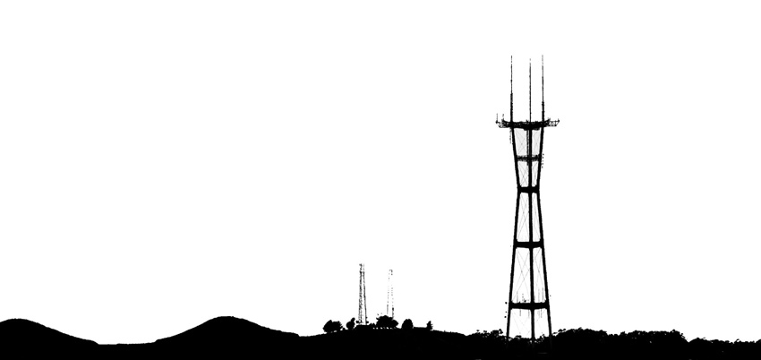

# Goings On About San Francisco



Scraping cool things to do in San Francisco with Python

## Overview

Goings On About San Francisco is a tool to identify cool things to do in San Francisco.

Inspired by The New Yorker's [Goings On About Town](http://www.newyorker.com/goings-on-about-town) section, this tool is intended to make  searching through San Francisco events easy. "Goings On" tracks concerts, art shows, sports events, lectures, culinary &amp; nightlife activities by using various feeds &amp; APIs to build a database. Running the script on your local device will output a comma delimited table to a given directory.

## How to Run

The simplest usage is to run the script with the desired output directory as the first command line argument.

```bash
git clone https://github.com/kazistan/goignson.git
cd goingson
python main.py <directory>
```

The result is a **goingson.csv** despoited in the directory specified on the command line <direcotry>.

## Tasks

The main work for the Goings On tool is to grow and clean feeds from various cultural events across the city.

*Feeds*

- [x] Commonwealth Club #politics
- [x] World Affairs Council #politics
- [ ] Stubhub API #music
- [ ] Oracle Arena &amp; Oakland Coliseum #music
- [ ] Another Planet Entertainment Concert Venues (Greek, Bill Graham, Fox, Tahoe, Independent) #music
- [ ] The Chapel #music
- [ ] The Fillmore #music
- [ ] Rickshaw Stop #music
- [ ] SF Symphony #music
- [ ] SFMoMa #art
- [ ] Legion of Honor #art
- [ ] DeYoung Museum #art
- [ ] SF Opera #theatre
- [ ] SF Ballet #theatre
- [ ] A.C.T. #theatre
- [ ] Castro Theatre RSS Feed #movies
- [ ] Oddball Films Blog #movies
- [ ] Punchline &amp; Cobb's Comedy #nightlife

*Tools*

- [ ] Front End Templates for Viewing GOSF
- [ ] Django Framework
- [ ] API for outputing list

## Copywrite

Image: "[Sutro Tower](https://www.flickr.com/photos/thomashawk/73803631/)" by [Thomas Hawk](https://www.flickr.com/photos/thomashawk/) licensed under [CC BY 2.0](https://creativecommons.org/licenses/by-nc/2.0/)
